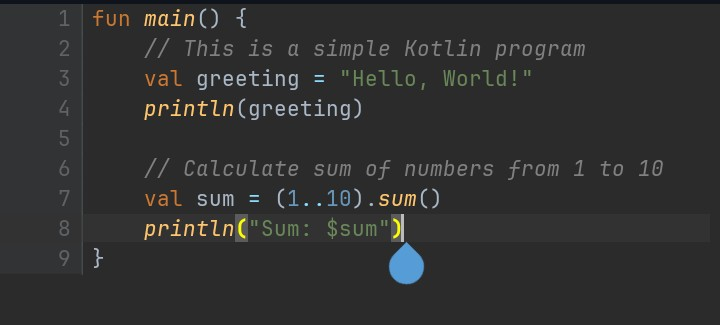

# CodeViewer

**CodeViewer** is a high-performance code view component for Android. It can handle files with **over 1 million lines** while maintaining smooth, responsive performance.

## Features

- [x] Syntax highlighting
- [x] Font and theme customization
- [x] Soft wrap support

## Screenshots



## Installation

Include the following line in your module-level `build.gradle.kts` (for Kotlin DSL) or `build.gradle` (for Groovy DSL) file, typically within the `dependencies` block:

**Kotlin DSL (`build.gradle.kts`):**

```kotlin
// build.gradle.kts (Module: app)
dependencies {
    implementation("io.github.itsvks19:codeeditor:1.2.0")
}
```

**Groovy DSL (`build.gradle`):**

```groovy
// build.gradle (Module: app)
dependencies {
    implementation 'io.github.itsvks19:codeeditor:1.2.0'
}
```

## Usage

```kotlin
val editorState = rememberCodeEditorState(
    File(filePath),
    language = PlainTextLanguage,
    theme = AtomOneDarkTheme
)

CodeEditor(
    state = editorState,
    initialFontSize = 14.sp,
    softWrap = true,
    modifier = Modifier.fillMaxSize()
)
```

## Performance

- Load and display 1 million+ lines
- Scroll and render with minimal memory overhead
- Maintain snappy performance even under heavy editing

## Roadmap

Planned features:

- [X] Multi-language syntax highlighting
- [ ] Cursor and selection support
- [ ] Keyboard navigation
- [ ] Code intelligence (autocomplete, linting)
- [ ] Undo/redo support
- [ ] Plugin architecture

## Built With

- Kotlin
- Jetpack Compose for UI

## Contributing

Contributions are welcome. If you have suggestions, bug reports, or want to get involved, feel free to open an issue or submit a pull request.

## License

MIT License. See [LICENSE](LICENSE) for details.

## Acknowledgments

Inspired by editor designs and architectures from:

- JetBrains IDEs
- Monaco Editor
- Zed Editor
